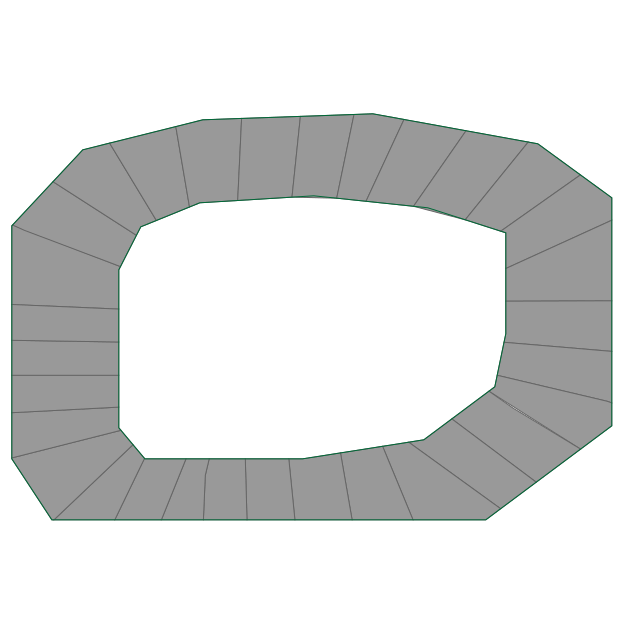

# KARTSGYM
 
Kartsgym is environment to train ai agent to drive kart in track.

The goal of this project to create realistic model of driving kart and use AI-based method to train agents.

# Observation space

Agent get information about:
 
 * kart's velocity in forward direction
 * kart's angular velocity
 * kart's distance to nearest obstacle in 5 directions


# Actions

Every frame agent can decide how much throttle he wants to use:
* <-1, 0) is break with force(or reversing)
* 0 is neutral
* (0, 1> is force forward

Also agent can decide of wheel rotation in radian from <-0.66, 0.66>

# Reward

Default environment(normal) reward is:
* -1 for each frame
* +250 for each checkpoint
* -1000000 for disqualification(hitting the railing, or going to previous checkpoint)
* -100 if agent sum reward went to 0 (too much frames without new checkpoint)

Simulation ends when agent will be in every checkpoint or if agent was disqualified. 

Alternative agent rewards:

* STEPS - as reward agent get number of steps in simulation
* DISTANCE - as reward agent get distance to nearest obstacle
* VELDISTANCE - the same as DISTANCE but multiplied by velocity

# Tracks

Currently our environment only support one track, but new trackes can be added by creating svg track with checkpoint in it.



## Agents types

In kartsgym currenty we have few agents types:

* RandomAgent - every agent move is random
* RuleAgent - agent is using some basic logic to drive forward
* QAgent - agent learned by Q fuction algorithm
* DNQAgent - agent learned by simulating neural network Q function.
 
## Instalation
 
 To install dependencies one will need to have [poetry](https://python-poetry.org/docs/).
 Then one can simply install dependencies executing:
 
 ```bash
poetry install
```

## Running

To use kartsgym one can execute it from console:

```bash
python -m kartsgym [-h] -t TYPE [-n NAME] [-a ALFA] [-g GAMMA] [-b BACKETS] [-ab ACTION_BACKETS] [-e EPOCHS] [-r REWARD]
```

Help information:
```
  -h, --help            show this help message and exit
  -t TYPE, --type TYPE  type of agent
  -n NAME, --name NAME  name of agent to test
  -a ALFA, --alfa ALFA  alfa for QAgent
  -g GAMMA, --gamma GAMMA
                        gamma for QAgent
  -b BACKETS, --backets BACKETS
                        observation backets for QAgent
  -ab ACTION_BACKETS, --action_backets ACTION_BACKETS
                        observation backets for QAgent
  -e EPOCHS, --epochs EPOCHS
                        epochs for Agent
  -r REWARD, --reward REWARD
                        reward system for Agent
```

## Training agents

Example commands to train models:

```bash
python -m kartsgym -t DNQ -e 200 -r DISTANCE
python -m kartsgym -t DNQ -e 200 -r VELDISTANCE

python -m kartsgym -t Q -e 10000 -r STEPS -ab 6 -b 8
python -m kartsgym -t Q -e 10000 -r NORMAL
```

## Evaluating agent

Example commands to evaluate agents

```
python -m kartsgym -t Random
python -m kartsgym -t Rule
python -m kartsgym -t Q -n q-7c6391af3b.pkl
python -m kartsgym -t DNQ -n dnq-d98ba283fd.h5
```
 